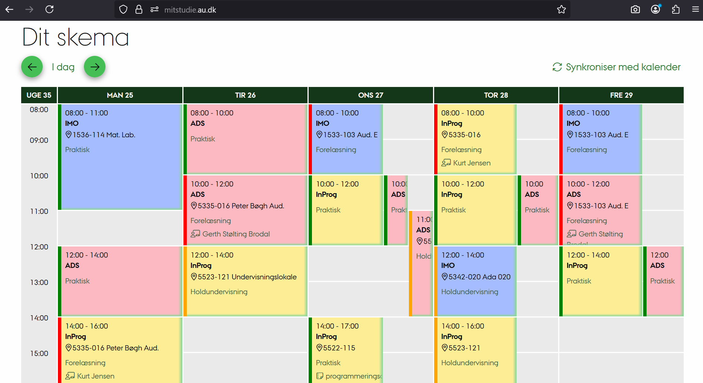

#  DAT2AU (browser extension)

Quality of life improvements til datalogi på AU. Virker på Chrome og Firefox.

* **Mitstudie:** forbedret skema på [mitstudie.au.dk](https://mitstudie.au.dk)
* **Panopto:** automatisk redirect til Embed view på [panopto](https://au.cloud.panopto.eu/Panopto/Pages/)
* **Vim Motions:** flyttet til [VimBrowser](https://github.com/gustavgodsk/VimBrowser)

Du kan tilføje udvidelsen her: [Chrome Webshop](https://chromewebstore.google.com/detail/dat2au/ndbknejadmdkfgpgkjnlkgmcemfnaaja?hl=da) og Firefox (snart)



# Tilpasning

Tryk på extension-ikonet for at gå til config-siden.

# Contributing

**1.** Lav en lokal kopi af projektet (se [Manuel Installation](#manuel-installation))

**2.** Opret ny fil `myscript.js` i `scripts/` mappen

Brug `scripts/template.js` til at komme i gang:
```javascript
{
    function setup() {
        if (!CONFIG.myscript.enabled) return;
        //
        // YOUR CODE HERE
        //
    }

    window.addEventListener("configReady", () => {
        setup();
    });

    if (window.CONFIG) {
        setup();
    }
}
```

**3.** Tilføj default config i `config/config.default.js`:

```javascript
const DEFAULT_CONFIG = {
    // ...
    myscript: {
        enabled: true,
        // add more options...
    }
}
```

**4.** Registrer script og URL matches i `manifest.json`
```json
"content_scripts": [
    // previous scripts...
    {
        "js": [
            "config/config.default.js",
            "config/config.loader.js",
            "scripts/myscript.js"
        ],
        "matches": ["https://example.com/*"]
    },
],
```
> Vigtigt: `config/config.default.js` og `config/config.loader.js` skal altid inkluderes i den rækkefølge for at dit script får adgang til config-filen

**5.** Lav pull request på GitHub

# Manuel Installation

Download filerne selv og gem i ny mappe eller kør
```git
git clone https://github.com/gustavgodsk/DAT2AU.git
```

### Chrome
1. Gå til chrome://extensions i Chrome
2. Sæt *Udviklertilstand* til oppe i højre hjørne
3. Tryk *Indlæs upakket*
4. Vælg mappen
5. Tryk på genindlæs-pilen

### Firefox
1. Gå til about:debugging#/runtime/this-firefox i Firefox
2. Tryk *Læs midlertidig tilføjelse*
3. Find mappen og vælg *manifest.json*
4. Tryk *Genindlæs*

> Vigtigt: Hvis du foretager ændringer lokalt, skal du *genindlæse* mappen før ændringerne træder i kraft.
